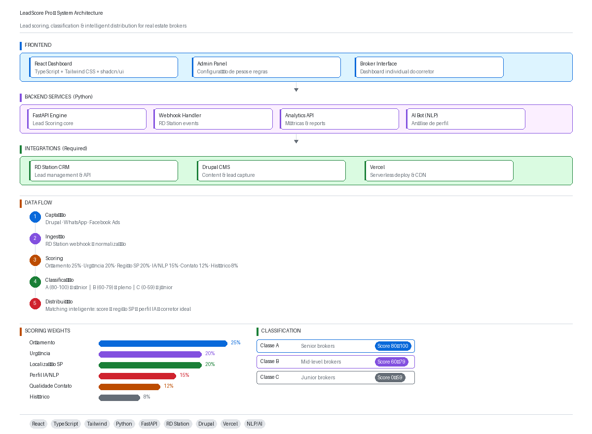

# AI Lead Scoring Platform

Conceptual architecture and implementation of an AI-powered lead qualification and intelligent distribution platform designed to optimize sales performance and conversion efficiency.

---

## Context

In high-volume lead generation environments, traditional distribution models often operate on a first-come, first-served basis, without considering lead quality, intent, or profile fit.

This approach creates inefficiencies in sales operations, leading to poor prioritization, lower conversion rates, and suboptimal customer experience.

This project explores how to design a scalable system capable of qualifying and routing leads intelligently, based on real-time data and behavioral signals.

---

## Objective

Design a platform capable of:

* Qualifying leads through conversational interfaces
* Applying real-time lead scoring using AI and NLP techniques
* Classifying leads based on intent, profile, and engagement level
* Enabling intelligent distribution aligned with sales strategy
* Integrating with CRM systems to support end-to-end conversion workflows

---

## Architecture Overview

The system is designed as a modular and scalable platform, supporting real-time processing and integration with external tools.

### Core Components

* **Conversational Interface Layer**
  Virtual assistant responsible for interacting with leads and collecting contextual data

* **Scoring Engine**
  AI-driven component responsible for evaluating and ranking leads based on predefined criteria and behavioral signals

* **API Gateway**
  Central entry point handling authentication, orchestration, and request routing

* **Service Layer**
  Responsible for lead processing, classification, routing, and business logic

* **Data Layer**
  Stores lead data, scoring history, and interaction logs

* **CRM Integration**
  Integration with platforms such as RD Station to enable funnel management and automated distribution

---

## Design Principles

* **Real-time processing** for immediate lead qualification
* **Modularity** to allow independent evolution of components
* **Scalability** to handle high volumes of concurrent leads
* **Data-driven decision making** through scoring and classification
* **Seamless integration** with CRM and marketing platforms

---

## Technical Perspective

The system balances speed and accuracy in lead qualification, leveraging:

* Conversational AI for data collection
* Natural Language Processing (NLP) for intent detection
* Scoring models to prioritize opportunities
* API-based integration with external systems

The architecture allows evolution from rule-based scoring to more advanced machine learning models over time.

---

## Trade-offs

* Real-time scoring vs. model complexity
* Accuracy vs. response time in conversational flows
* Centralized orchestration vs. distributed services
* Simplicity in initial implementation vs. long-term scalability

---

## Possible Evolution

* Machine learning models for predictive lead scoring
* Event-driven architecture for asynchronous processing
* Advanced segmentation and personalization strategies
* Integration with additional marketing and sales platforms
* Feedback loops to continuously improve scoring accuracy

---

## Purpose of this Repository

This repository demonstrates:

* Architectural thinking applied to real business problems
* Design of scalable AI-driven systems
* Decision-making in complex, data-driven environments
* Integration between conversational interfaces and CRM ecosystems

It is intended as a conceptual and strategic reference rather than a production-ready system.

---
